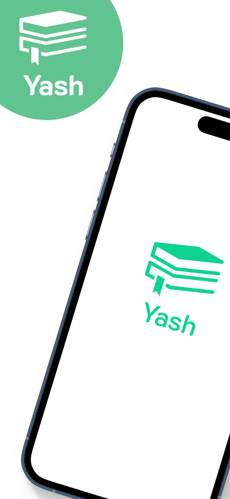

# Yash - Book Store App

A modern and secure **Flutter** app built with **GetX** and **Appwrite**, designed for book lovers to discover, buy, and read books with a smooth, fast, and elegant experience.

## 📸 Screenshots

<div align="center">
  
  
  
  
  
  
  
</div>

## ✨ Features

* 🔑 **Authentication:** Secure login via **Email & Password** or **Google OAuth2** using Appwrite.
* 📚 **Store:** Discover new books and browse by categories.
* 📖 **Bookshelf:** Manage your purchased books and track reading progress.
* ⚙️ **Settings:** Change app theme and language (Arabic, French, English).
* ℹ️ **Book Details:** View book info, price, and add to cart or buy instantly.
* 🛒 **Cart:** Edit your cart and pay securely via **Chargily** (Edahabia & CIB).
* 📂 **Categories:** Filter books by genre or topic.
* 📕 **Book Reader:** Built-in reader with screenshot protection for privacy.
* ⚡ **Offline Cache:** Stores user info, cart data, and settings for better performance.

## ⚙️ Setup

1. Clone the repository

   ```bash
   git clone https://github.com/sidali-dev/yash.git
   cd yash
   ```
2. Install dependencies

   ```bash
   flutter pub get
   ```
3. Configure your **Appwrite** project (Database, Authentication, Storage, Functions).
4. Add your **Chargily** API credentials for payment integration.
5. Run the app

   ```bash
   flutter run
   ```

---

## 🧩 Dependencies

### 🧠 Core

* **get:** ^4.6.6 → State management, routing, and dependency injection
* **appwrite:** ^18.0.0 → Backend services, authentication, and database
* **get_storage:** ^2.1.1 → Lightweight local storage (caching user/cart data)
* **flutter_dotenv:** ^5.2.1 → Environment variable management

### 🎨 UI & Animations

* **flutter_animate:** ^4.5.0 → Smooth UI animations and transitions
* **lottie:** ^3.3.1 → Animated illustrations for onboarding and feedback
* **carousel_slider:** ^5.1.1 → Interactive book carousels in the store
* **icons_plus:** ^5.0.0 → Modern and diverse icon pack
* **flutter_svg:** ^2.2.0 → SVG image rendering for scalable UI

### 🌍 Localization & Data

* **intl:** ^0.20.2 → Internationalization and date formatting
* **flutter_localizations:** Built-in Flutter localization support
* **http:** ^1.5.0 → REST API calls and network requests

### 📖 Reader & Web

* **syncfusion_flutter_pdfviewer:** ^31.1.19 → In-app PDF book reader
* **no_screenshot:** ^0.3.1 → Screenshot protection for secure reading
* **webview_flutter:** ^4.13.0 → Embedded web content and external pages

---

## 🏗️ Project Structure

```
app/
├── const/           # App constants, enums, and static values
├── controllers/     # GetX controllers (state management)
├── helpers/         # Utility and helper functions
├── model/           # Data models
├── repository/      # Data sources and logic abstraction
├── routes/          # App navigation and route configuration
├── services/        # Appwrite & Chargily integrations
├── theme/           # Themes, colors, and typography
├── views/           # App screens (UI)
├── widgets/         # Reusable UI components
├── main.dart        # App entry point
└── app.dart         # Root widget configuration
```

---

## 💳 Payment Integration

Payments are handled through **Chargily**, supporting both **Edahabia** and **CIB** cards in Algeria for seamless local transactions.

## 🔐 Security

* Screenshot protection in book reader
* Appwrite-managed authentication and access control
* Local caching for optimized offline experience

## 📜 License

MIT License

---

Do you want me to make a **shorter version** of this (for your GitHub description section and repository bio)?


